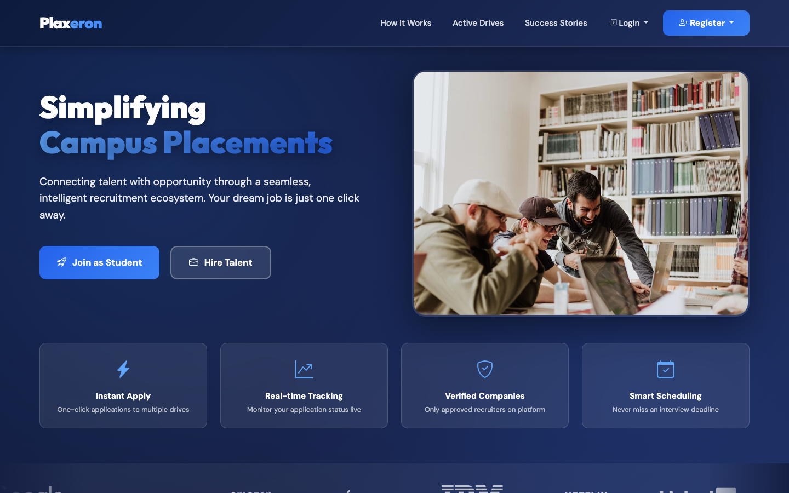
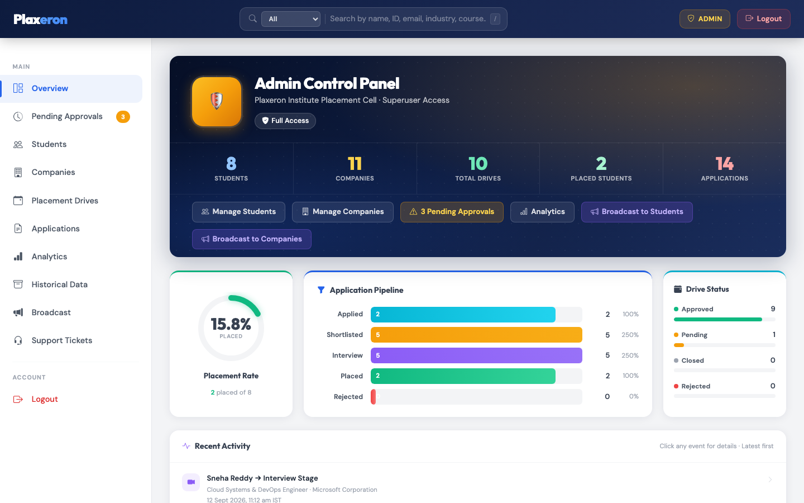
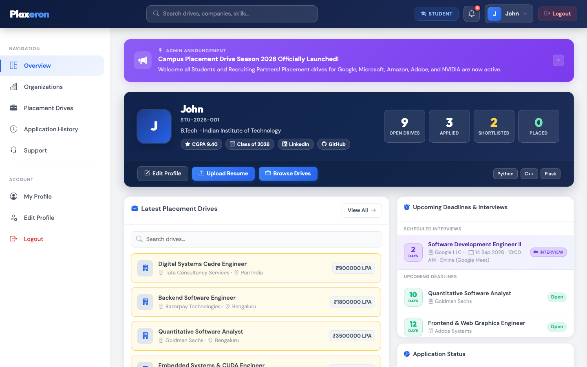
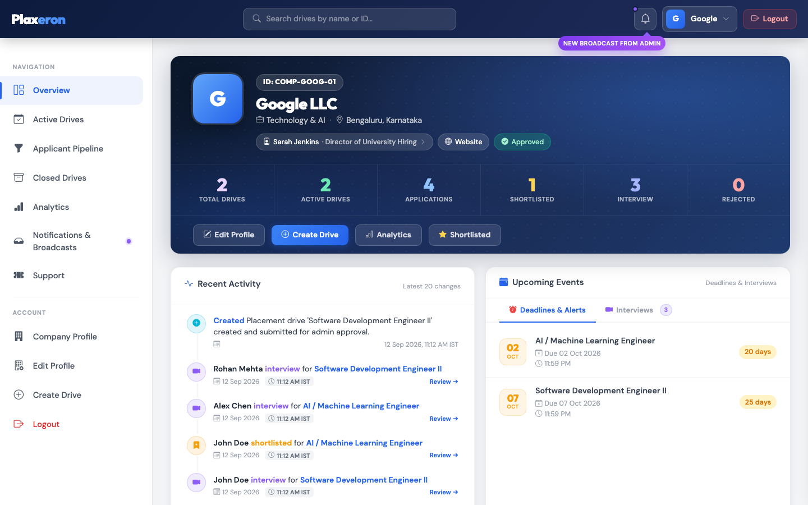
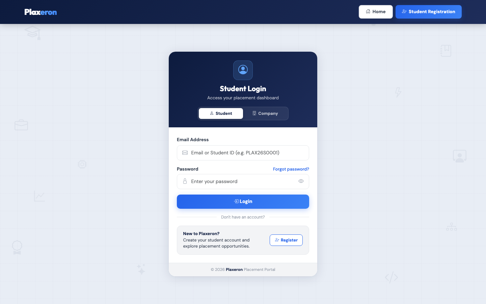
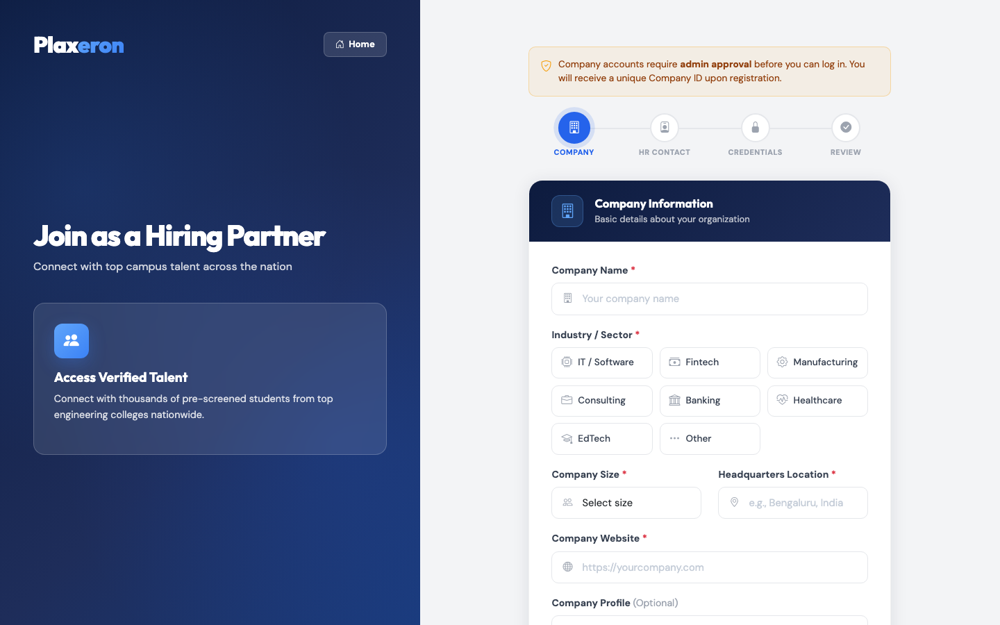

# 🚀 Plaxeron – Enterprise Campus Placement & Recruitment Portal

<p align="center">
  
</p>

<p align="center">
  <strong>A comprehensive, modern, enterprise-grade placement management platform seamlessly connecting Students, Educational Institutions, and Corporate Recruiters in one unified ecosystem.</strong>
</p>

<p align="center">
  <a href="#-live-demo"></a>
  <a href="#-tech-stack"></a>
  <a href="#-tech-stack"></a>
  <a href="#-api-documentation"></a>
  <a href="LICENSE"></a>
</p>

---

## 🌐 Live Demo

Explore the live production deployment of the Plaxeron Portal:
👉 **[Launch Plaxeron Placement Portal](http://priyavartjakhar.pythonanywhere.com)**

### 🔑 Instant Demo Credentials

| Role | Email | Password | Access Level |
| :--- | :--- | :--- | :--- |
| 🛡️ **Institutional Admin** | `admin@plaxeron.com` | `admin123` | Full System Analytics, Approvals, & User Controls |
| 🎓 **Student / Candidate** | `student@plaxeron.com` | `student123` | Drive Applications, Profile Manager, & Notifications |
| 💼 **Corporate Recruiter** | `recruiting@google.com` | `company123` | Drive Posting, Candidate Review, & Interview Scheduler |

---

## 📋 Table of Contents

- [✨ Core Features](#-core-features)
- [📸 Visual Tour & Screenshots](#-visual-tour--screenshots)
- [🛠 Tech Stack](#-tech-stack)
- [📁 Directory Structure](#-directory-structure)
- [⚡ Quick Start & Installation](#-quick-start--installation)
- [🌱 Seed Mock Data](#-seed-mock-data)
- [📖 API Documentation](#-api-documentation)
- [🔒 Security & Role-Based Control](#-security--role-based-control)
- [🤝 Contributing & License](#-contributing--license)

---

## ✨ Core Features

### 🎓 Student Hub
* **Smart Drive Explorer**: Search, filter, and discover placement drives by CTC package range, job title, target eligibility degree, and location.
* **1-Click Application Workflow**: Instant candidate application with resume verification and duplicate application prevention.
* **Real-Time Application Status**: Track candidate application lifecycle stages (`Applied` ➔ `Shortlisted` ➔ `Interview Scheduled` ➔ `Placed` / `Rejected`).
* **Academic Profile Management**: Update CGPA, 10th/12th percentages, graduation year, tech stack skills, LinkedIn, GitHub, and PDF resume upload.
* **Smart Notification Center**: Instant real-time alerts for interview invitations, shortlist updates, and institutional broadcasts.

### 🏢 Corporate Recruiter Hub
* **Placement Drive Manager**: Create, publish, edit, or close job drives with package CTC, vacancies, selection process, and target CGPA criteria.
* **Applicant Screening & Resume Viewer**: Access candidate profiles, view uploaded PDF resumes, and filter candidates by academic performance.
* **Interview Scheduler**: Schedule technical & HR interview rounds specifying date, time, mode (Google Meet, Zoom, MS Teams, Campus Venue), and evaluator notes.
* **Status Updates & Remarks**: Shortlist, invite for interviews, accept offers, or provide feedback remarks directly to candidates.
* **Corporate Support**: Submit inquiries and support tickets directly to the institutional placement cell.

### 🛡️ Institutional Admin Portal
* **Executive Metrics Dashboard**: Overview of system placement stats (Total Registered Students, Verified Recruiter Companies, Active Drives, & Total Offer Placements).
* **Approval Workflows**: Verification panel to review and approve/reject new recruiter company registrations and job placement drives.
* **User & System Governance**: Blacklist or activate student or corporate accounts with full audit logging (`DeletedStudentLog`, `DeletedCompanyLog`).
* **Institutional Broadcasts**: Send targeted or system-wide broadcast announcements to all registered students and recruiters.
* **Support Ticket Resolution**: Integrated helpdesk for managing and responding to inquiries from candidates and corporate partners.

### ⚡ OpenAPI REST Engine
* **Standardized API Engine**: Fully documented OpenAPI 3.0 spec (`api.yml`) providing endpoints for authenticating, fetching notifications, and managing applications.
* **Role-Based Token / Session Security**: Enforces strict actor checks to ensure data isolation across roles.

---

## 📸 Visual Tour & Screenshots

<div align="center">

### 🌐 Public Landing Page & Portal Showcase
<p align="center">
  
</p>
<p><em>Hero section displaying live placement statistics, featured recruiter partner tickers, and quick portals for candidates and enterprises.</em></p>

<br/>

### 📊 Institutional Admin Control Panel
<p align="center">
  
</p>
<p><em>Executive dashboard featuring system analytics counters, corporate & drive approval queues, user management tables, and system broadcast tools.</em></p>

<br/>

### 🎓 Student Placement & Career Dashboard
<p align="center">
  
</p>
<p><em>Student view showcasing active recruitment drives, CTC packages, 1-click application triggers, and real-time status tracking badges.</em></p>

<br/>

### 💼 Corporate Recruiter & Drive Manager
<p align="center">
  
</p>
<p><em>Recruiter workspace for publishing job drives, evaluating candidate applications, downloading resumes, and scheduling interview rounds.</em></p>

<br/>

### 🔐 Multi-Role Authentication & Recruiter Onboarding
<table width="100%">
  <tr>
    <td width="50%" align="center">
      
      <br/><strong>Candidate & Recruiter Login</strong>
    </td>
    <td width="50%" align="center">
      
      <br/><strong>Corporate Verification Onboarding</strong>
    </td>
  </tr>
</table>

</div>

---

## 🛠 Tech Stack

| Layer | Technology | Details |
| :--- | :--- | :--- |
| **Backend Framework** | [Flask 3.0](https://flask.palletsprojects.com/) | Python microframework with modular routing & blueprints |
| **Database ORM** | [SQLAlchemy 2.0](https://www.sqlalchemy.org/) | Relational database ORM with foreign key cascades & migrations |
| **Database Engine** | [SQLite](https://sqlite.org/) | Embedded relational SQL database for high-speed local deployment |
| **Authentication** | [Flask-Login](https://flask-login.readthedocs.io/) | Session-based role-authenticated security with password hashing (`Werkzeug`) |
| **Frontend UI** | HTML5, CSS3, JavaScript | Modern responsive CSS layout, vanilla JavaScript, Bootstrap icons |
| **API Specification** | [OpenAPI 3.0 / Swagger](https://swagger.io/specification/) | Restful API contracts defined in `api.yml` |

---

## 📁 Directory Structure

```text
Plaxeron-Placement-portal/
├── app.py                      # Core Flask application, controllers & routing logic
├── models.py                   # Consolidated SQLAlchemy models (15 relational schemas)
├── seed_data.py                # Database mock data seeding script
├── requirements.txt            # Python dependencies
├── api.yml                     # OpenAPI 3.0 REST API specification
├── render.yaml                 # Render cloud deployment configuration
├── assets/
│   └── screenshots/            # UI documentation screenshots
│       ├── landing_page.png
│       ├── admin_dashboard.png
│       ├── student_dashboard.png
│       ├── company_dashboard.png
│       ├── auth_login.png
│       └── company_register.png
├── static/
│   ├── css/                    # Modular stylesheet components per role
│   ├── js/                     # Client-side dynamic interaction scripts
│   └── uploads/                # Resume PDF file storage
└── templates/
    ├── auth/                   # Login, register, forgot-password templates
    ├── dashboards/             # Admin, Student, and Company dashboards
    ├── errors/                 # HTTP 404/500 error pages
    └── index.html              # Public landing page template
```

---

## ⚡ Quick Start & Installation

### Prerequisites
* Python 3.9+
* `pip` and `virtualenv`

### Step 1: Clone Repository & Create Virtual Environment
```bash
git clone https://github.com/priyavartjakhar/Plaxeron-Placement-portal-web-application.git
cd Plaxeron-Placement-portal-web-application

python3 -m venv venv
source venv/bin/activate  # On Windows: venv\Scripts\activate
```

### Step 2: Install Dependencies
```bash
pip install -r requirements.txt
```

### Step 3: Seed Database with Demo Data
Run the included seed script to initialize `placement_portal.db` with full sample data (Students, Companies, Drives, Applications, Schedules):
```bash
python seed_data.py
```

### Step 4: Run Application
```bash
python app.py
```
Open your browser and navigate to: **`http://127.0.0.1:5000`**

---

## 📖 API Documentation

Plaxeron provides a standard OpenAPI 3.0 specification in [`api.yml`](api.yml).

To view the interactive Swagger API documentation locally or online:
1. Open [Swagger Editor](https://editor.swagger.io/).
2. Import the `api.yml` file from this repository.
3. Explore endpoints for authentication, notification polling, and drive management.

---

## 📄 License

Distributed under the **MIT License**. See `LICENSE` for more information.

---

<p align="center">
  Developed with ❤️ for streamlined campus placements.
</p>
